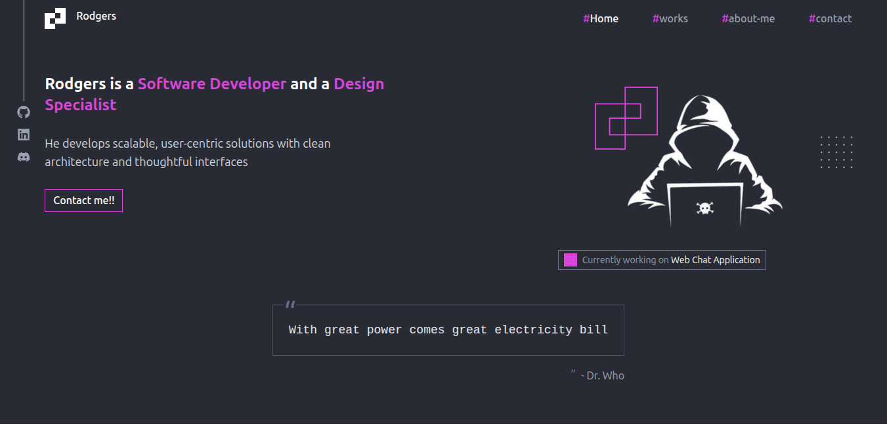

# Rodgers Munene - Portfolio

A modern, responsive portfolio website showcasing my work as a **Software Developer** and **Problem Solver** based in Kenya.



## 🚀 About

This portfolio is a collection of my projects, skills, and journey as a full-stack developer. I specialize in building scalable solutions from intuitive UIs to secure backend systems.

### What I Do

- **Web Development**: Building responsive, performant web applications using React, Node.js, and modern frameworks
- **Mobile Development**: Creating cross-platform mobile apps with React Native and Flutter
- **Backend Systems**: Designing robust APIs and databases with Node.js, Express, PostgreSQL, and MongoDB
- **UI/UX Design**: Crafting clean, user-friendly interfaces with Tailwind CSS and Framer Motion animations

## 🛠️ Tech Stack

| Category      | Technologies                                                                 |
|---------------|------------------------------------------------------------------------------|
| **Languages** | Java, JavaScript, Python, TypeScript, Dart, PHP                              |
| **Frontend**  | React, React Router, Tailwind CSS, Framer Motion, HTML5, CSS3                |
| **Backend**   | Node.js, Express.js, PHP                                                     |
| **Mobile**    | React Native, Flutter                                                        |
| **Databases** | PostgreSQL, MySQL, MongoDB, Firebase Firestore                               |
| **Tools**     | Git/GitHub, Docker, Linux, VSCode, Android Studio                            |

## 📁 Project Structure

```
PortFolio/
├── src/
│   ├── assets/              # Images, icons, and static files
│   ├── components/          # Reusable UI components
│   │   ├── home-components/ # Home page specific components
│   │   ├── projects/        # Project display components
│   │   └── ...
│   ├── pages/               # Page components (Home, Projects, About, Contact)
│   ├── services/            # Data and API services
│   │   └── Data.js          # Projects and skills data
│   └── utils/               # Utility functions
├── public/                  # Public assets
├── package.json             # Dependencies and scripts
├── vite.config.js           # Vite configuration
└── tailwind.config.js       # Tailwind CSS configuration
```

## 🎯 Featured Projects

### Major Projects

| Project       | Description                                                  | Tech Stack                        |
|---------------|--------------------------------------------------------------|-----------------------------------|
| **Agrotrack** | Mobile app for farmers with crop monitoring, soil health, pest detection | React Native, TypeScript, PostgreSQL, Node.js |
| **EventHub**  | Comprehensive event management system                        | React, Node.js, Express, MySQL    |
| **Ekshop**    | E-commerce platform serving Nyeri with M-Pesa integration    | PHP, MySQL, JavaScript            |
| **SwiftCart** | Full-stack e-commerce with M-Pesa payments                   | Node.js, React, Express, MongoDB  |
| **FilmSage**  | Movie recommendation web application                         | React, Node.js, TypeScript        |

### Small Projects

- **Flutter Movie App** - Movie discovery app built with Flutter & Dart
- **Waste Management System** - Web3-enabled waste collection platform
- **Trading Algorithm** - Python-based trading algorithm using statistics

## 🚀 Getting Started

### Prerequisites

- Node.js (v18 or higher)
- npm or yarn

### Installation

1. Clone the repository:
   ```bash
   git clone https://github.com/rodgers-munene/portfolio-final.git
   cd portfolio-final
   ```

2. Install dependencies:
   ```bash
   npm install
   ```

3. Start the development server:
   ```bash
   npm run dev
   ```

4. Open your browser and navigate to `http://localhost:5173`

### Build for Production

```bash
npm run build
```

## 📄 Scripts

| Command        | Description                                    |
|----------------|------------------------------------------------|
| `npm run dev`  | Start development server with HMR              |
| `npm run build`| Build for production                           |
| `npm run lint` | Run ESLint for code quality                    |
| `npm run preview`| Preview production build locally            |

## 🎨 Features

- **Responsive Design**: Optimized for mobile, tablet, and desktop
- **Smooth Animations**: Powered by Framer Motion
- **Project Filtering**: Filter projects by category (All, Mobile, Backend, Web)
- **Interactive Modals**: Detailed project views with animations
- **Dark Theme**: Modern dark UI with purple accent colors
- **Contact Form**: Integrated email functionality via EmailJS

## 📱 Pages

- **Home** - Hero section, about me, featured projects, skills, and contact
- **Projects** - Full project showcase with filtering and details
- **About Me** - Detailed information about my journey
- **Contact Me** - Contact form and social links

## 🔗 Live Demo

Visit the live portfolio: [Your Portfolio URL]

## 📧 Contact

- **GitHub**: [@rodgers-munene](https://github.com/rodgers-munene)
- **Email**: [munenerodgers72@gmail.com]
- **LinkedIn**: [LinkedIn](https://www.linkedin.com/in/rodgers-munene-19558135b/)

## 📝 License

This project is open source and available under the MIT License.

---

**Built with** ❤️ **using React, Vite, and Tailwind CSS**
